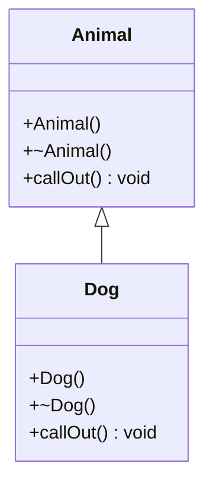

# OAMK

## Luokat

```mermaid
classDiagram

    Animal <|-- Dog

    class Animal {
        +Animal()
        +~Animal()
        +callOut() void
    }

    class Dog {
        +Dog()
        +~Dog()
        +callOut() void
    }
```